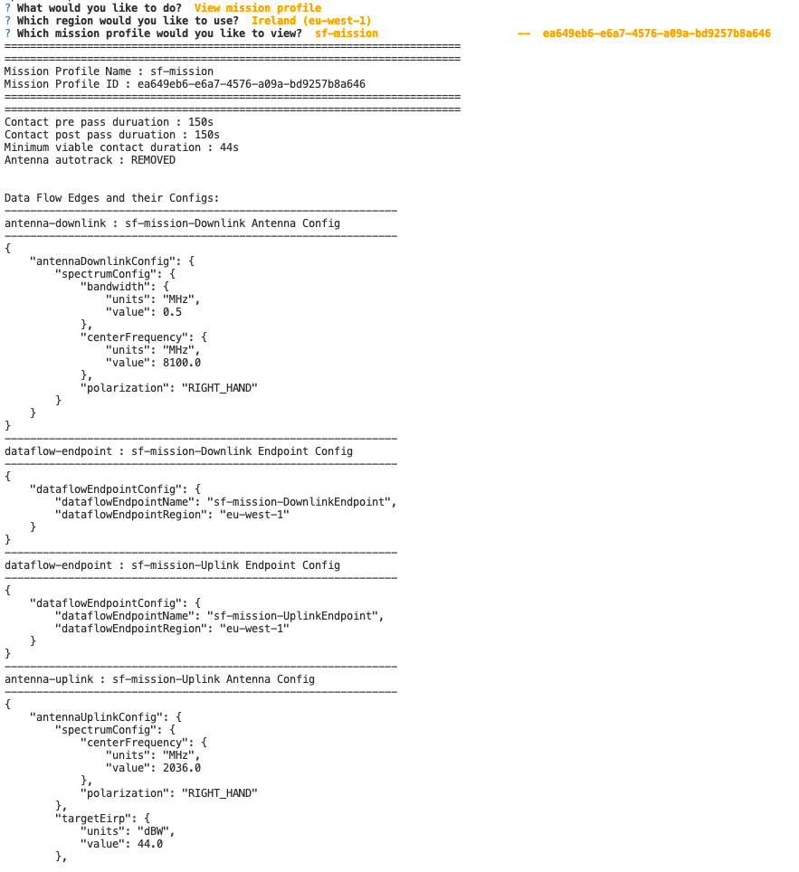

# CLI tool for viewing and updating AWS Ground Station mission profiles 

##  Solution overview

This repo contains an interactive CLI utility for viewing and updating AWS Ground Station mission profiles. The mission profile and associated configurations are not exposed on the AWS web console, so we need to navigate the API and CLI to show these configuration while debugging AWS Ground Station. This navigation can be difficult at times, so this tool aims to streamline the process and assist in debugging. 

The tool can:
1. Show details about an AWS Ground Station mission profiles
2. Update the following AWS Ground Station mission profile parameters:
   - Mission profile name
   - Uplink power
   - Uplink center frequency
   - Uplink polarization
   - Downlink polarization
   - DigIF Downlink center frequency
   - DigIF Downlink bandwidth
   - Minimum viable contact duration
   - Contact prepass duration
   - Contact postpass duration
   - Antenna tracking
3. Show AWS Ground Station minute usage

This tool is meant a debugging aid and should cannot be used to deploy full AWS Ground Station mission profiles. For such deployments the best practice is to use AWS CloudFormation templates, which can be source-code controlled. Please be mindful of any configuration drift that is introduced.

The tool uses default AWS CLI credentials stored in the /.aws folder
Learn how to set up your AWS CLI: https://docs.aws.amazon.com/cli/latest/userguide/cli-chap-welcome.html  

NB: Updating a mission profile will not update the execution parameters for existing future contacts.

boto3 GroundStation reference: https://boto3.amazonaws.com/v1/documentation/api/latest/reference/services/groundstation.html

## Usage examples 

Install the required Python modules 

```bash
python3 -m pip install -r requirements.txt    
```


Run the utility and follow the on screen instructions. 

```bash
python3 gs-config.py    
```

### Viewing AWS Ground Station mission profiles 

